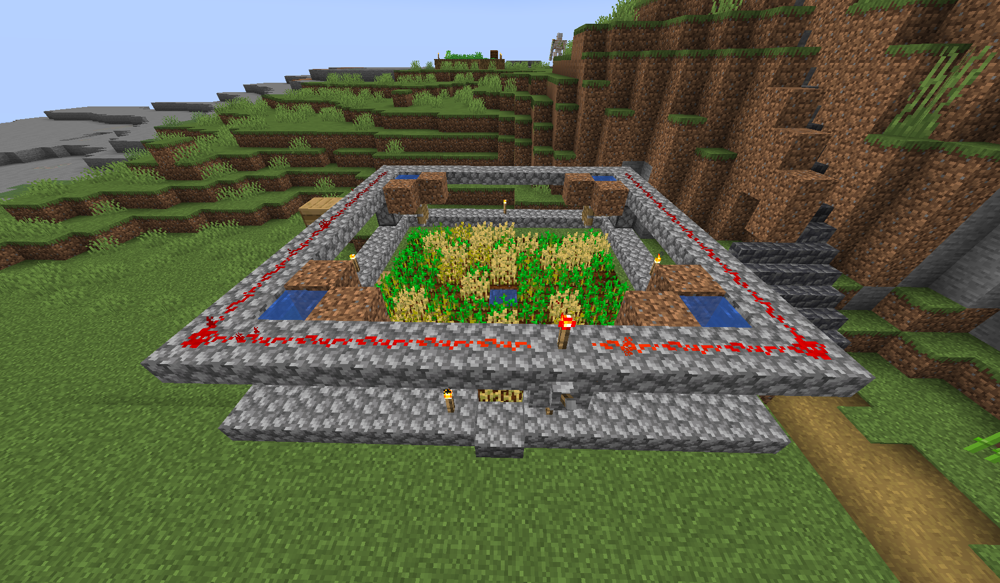
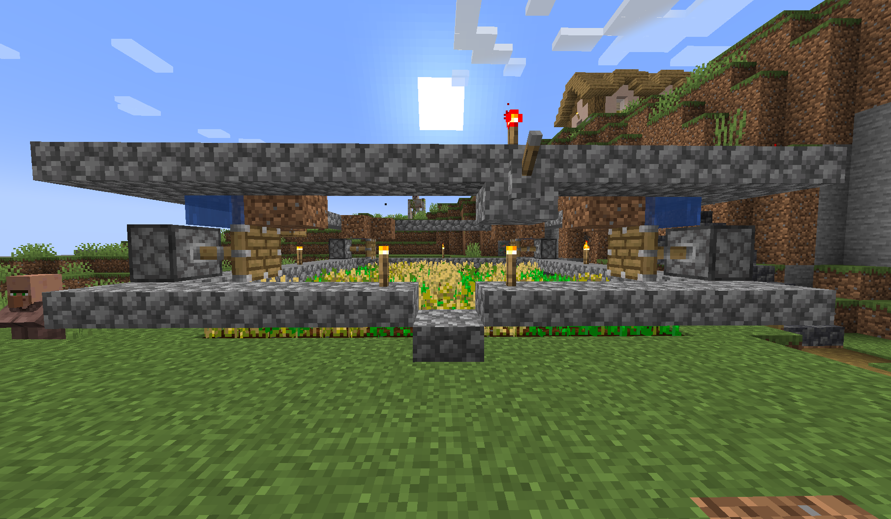

- 参考：[https://www.zhihu.com/question/20750149/answer/34856569](https://www.zhihu.com/question/20750149/answer/34856569)
- 简介：抽水马桶式小麦种植场，建议不要超过1层，多了吃不完。
- 材料：
	- 活塞×4
	- 红石×28
	- 半砖×85
	- 红石火把×1
	- 拉杆×1
- 图片：
	- 
	- {:height 551, :width 931}